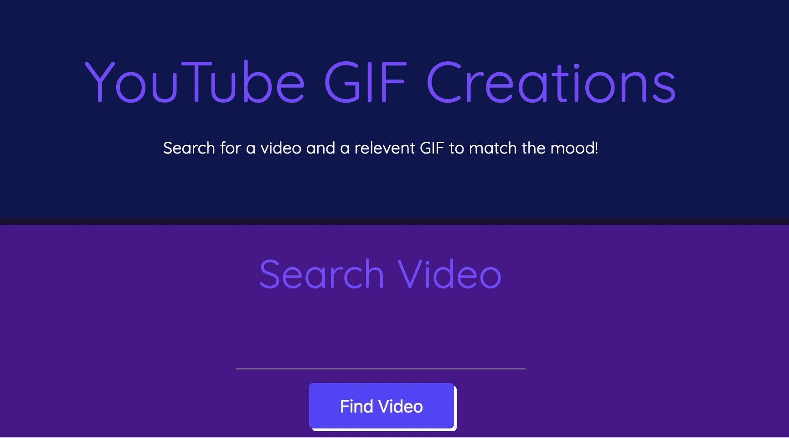
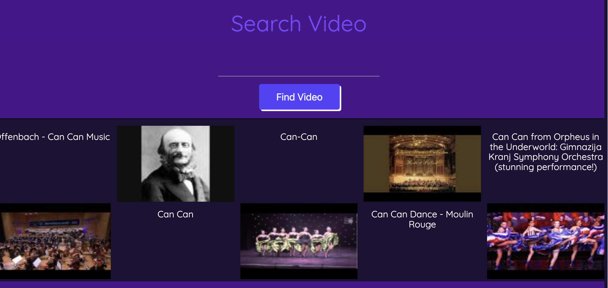
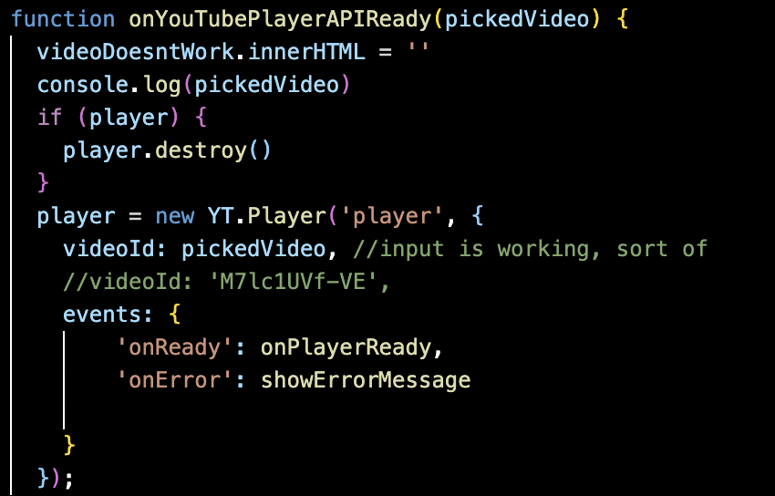
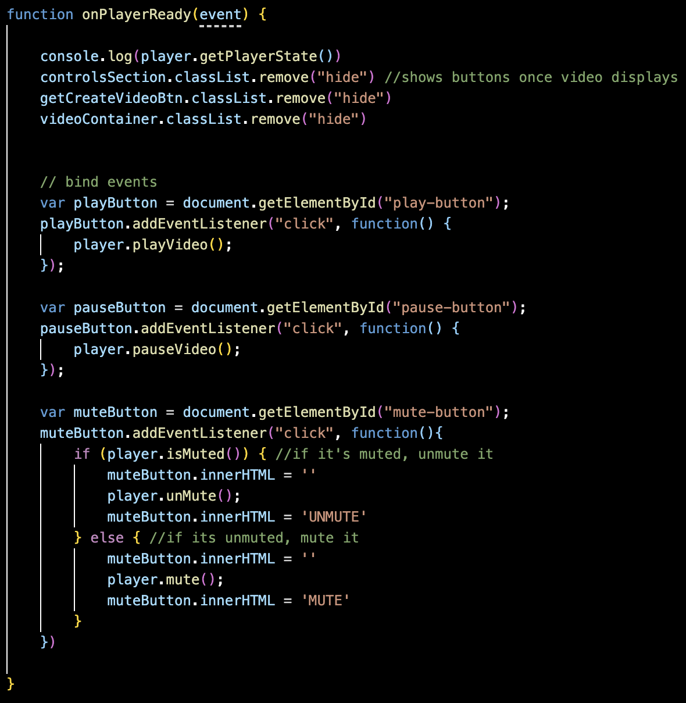

# Youtube GIF Creations

This is an app where you can easily make videos with your favorite songs
and a relevant gif to create a better listening experience

## User Story

- As a music listener
- I want to listen to a song with a cool/related gif executing
- So that I can have a better listening experience

## Acceptance Criteria

- Given I am looking to make a video
- When I search for a song
- Then I am presented with results for that song
- When I search for a gif
- Then I am presented with relevant gifs
- When I choose a song and gif
- Then I create a video with that song and gif
- When I reload the webpage
- Then I am presented with my last 5 creations

## Wireframe

Our vision before development

## Final Product

See the final product [here](https://dltorrise.github.io/Youtube-Gif-Creations/)

## Screenshots of Finished Product

Webpage Appearance

Using the video search engine

Using the gif search engine

## APIs

Youtube Data API, Youtube Iframe API, and Giphy API

## Code Snippets of Iframe API

One of the most challenging aspects of this project was getting the external play and pause buttons to work using the Iframe API. Watching [this video](https://www.youtube.com/watch?v=bHQqvYy5KYo) by Youtube Developers and reading the [documentation on Iframe Players](https://developers.google.com/youtube/iframe_api_reference) helped us finally wrap our heads around how to create a player object. 

Here are some code snippets of the player object and some functions attached to the built-in event listeners:

This code is specifically built-in functions to the Youtube Iframe Player API, including playVideo(), pauseVideo(), and muteVideo() so that we can control the video outside of the Iframe:

## Development

The cool thing about developing this project is that we learned in the branch testing-branch a good way to develop websites. It's best to lay everything out so that you can simulataneously check if different parts of the code are working. It's better that the page has a development phase where everything is layed out for the purposes of development as opposed to emphasizing aesthetics or what the product is supposed to look like. Aesthetics can come last after all the functionality is minimumally viable. 

## Additional Functionalities

Along with the basic functionalities, there are also several error messages to indicate if you selected something wrong. This is meant to add to the user experience, so they won't experience as much confusion or frustration if something is not working properly. Thankfully, the Iframe API has a built-in event listener (onError) solely for this purpose. 

## Future Development

In the future, we have several ideas on how to make this product better. 

One idea is to add more external controls to the video. This screenshot exhibits other toggle controls of the volume and time. It's from the video mentioned above created by Youtube developers.

We also thought it would be a cool idea to add custom backgrounds to the video just to make the watching/listening experience more fun. It could be galaxy, for example. 

Finally we desire to make some more practical changes, such as improving the resolution of the gifs. 

## Acknowledgements

[Red Panther](https://www.youtube.com/c/redpantherio) helped me with the play, pause, and stop buttons in the Youtube Iframe API with [this video](https://www.youtube.com/watch?v=5Y-aYA6YLlg) on his YouTube Channel. 

I also got help from [ThirteeNov Coding Tutorials](https://www.youtube.com/@ThirteeNov) in [his video](https://www.youtube.com/watch?v=QkWOaqGn9Vg&t=183s) about dynamically playing videos in iframe. 
