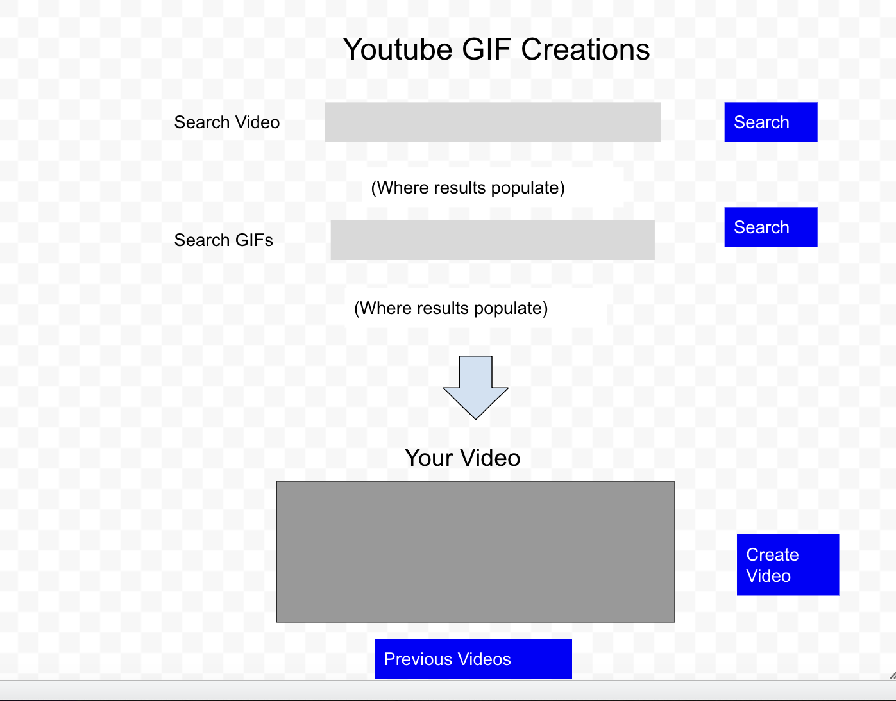

# Youtube GIF Creations

This is an app where you can easily make videos with your favorite songs
and a relevant gif to create a better listening experience

# User Story

As a music listener
I want to listen to a song with a cool/related gif executing
So that I can have a better listening experience

## Acceptance Criteria

Given I am looking to make a video
When I search for a song
Then I am presented with results for that song
When I search for a gif
Then I am presented with relevant gifs
When I choose a song and gif
Then I create a video with that song and gif
When I reload the webpage
Then I am presented with my last 5 creations

## Wireframe

## APIs

Youtube & Giphy

## Rough Breakdown of Tasks

- Create a Layout (dark layout)
- Fetch the APIs (creating buttons to search)
- Append them onto the screen, once they are searched
- Select a video and gif of choice (event.target)
- Create a video based on those choices (based on what you select that
will be appended to a different part of the screen and once you click
create video, this will take you to a different page with the new video
and save it in local storage)
- Create a button to go back to search and view last five videos in local storage
- Save the last five videos in local storage  
- Make it look nice